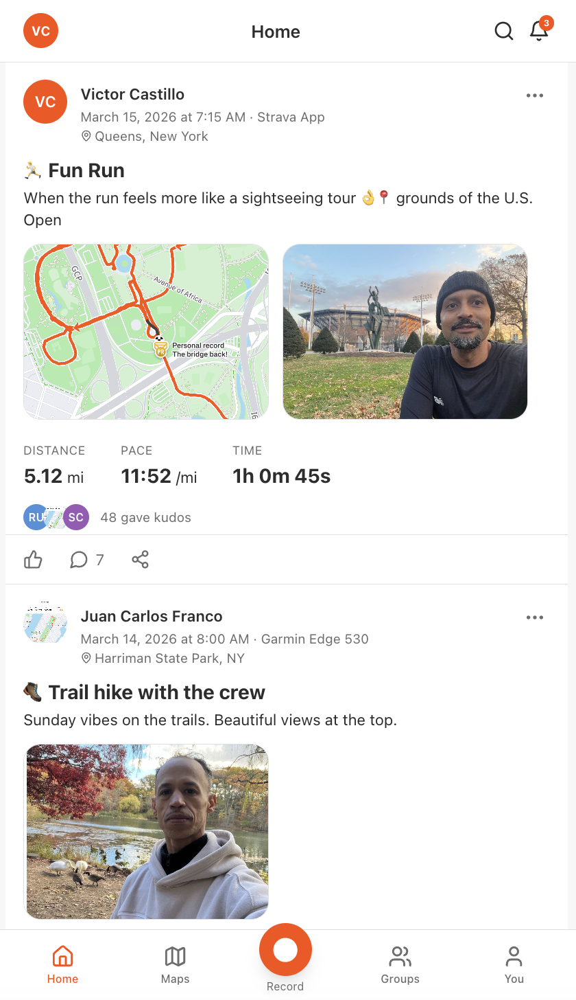
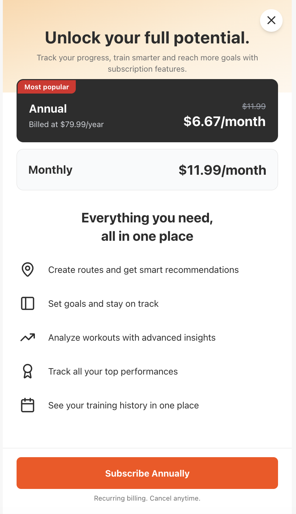

# Strava Clone — Social Fitness Tracker

A freemium social fitness platform where users log workouts, follow friends, and engage with a community activity feed.

---

## Screenshots

**Activity feed with kudos, comments, route maps, and photos**



**Premium paywall — exact recreation of Strava's upgrade modal**



---

## The Problem

Fitness enthusiasts lack a simple, social way to track workouts and stay motivated long-term. Existing solutions are either too complex, too expensive upfront, or lack the community features that drive retention — users with social connections show **3x higher retention** than solo trackers.

---

## The Solution

A freemium social fitness platform with effortless activity logging and social engagement as the free hook, and locked premium features (analytics, leaderboards, goal tracking) as the conversion mechanism — all client-side with no backend required.

---

## Key Features

### Free Tier
- Activity logging with auto-calculated pace across 6 activity types (Run, Ride, Swim, Hike, Walk, Other)
- Social activity feed with kudos and comments for followed users
- Follow/unfollow system with user search
- Pre-seeded demo data with realistic users and activities

### Premium (Mock Conversion Flow)
- Strategic paywall placement on analytics, leaderboards, goals, and personal records
- Mock upgrade flow that activates premium status and updates the UI
- Exact recreation of Strava's paywall modal design

---

## Tech Stack

| Layer | Technologies |
|---|---|
| Frontend | React 18, Vite, Tailwind CSS 3 |
| State | React Context API |
| Icons | lucide-react |
| Storage | localStorage (no backend) |

---

## Getting Started

```bash
# Clone the repository
git clone https://github.com/victorcastillo-pursuit/strava-clone.git
cd strava-clone

# Install dependencies
npm install

# Start development server
npm run dev
```

Open [http://localhost:5173](http://localhost:5173) in your browser.

A demo user is pre-selected — no login required. Use **Reset Demo Data** in settings to reseed fresh data.

---

## Project Type

Pursuit Fellowship — Pair programming project
**Team:** Victor Castillo & Juan Franco
